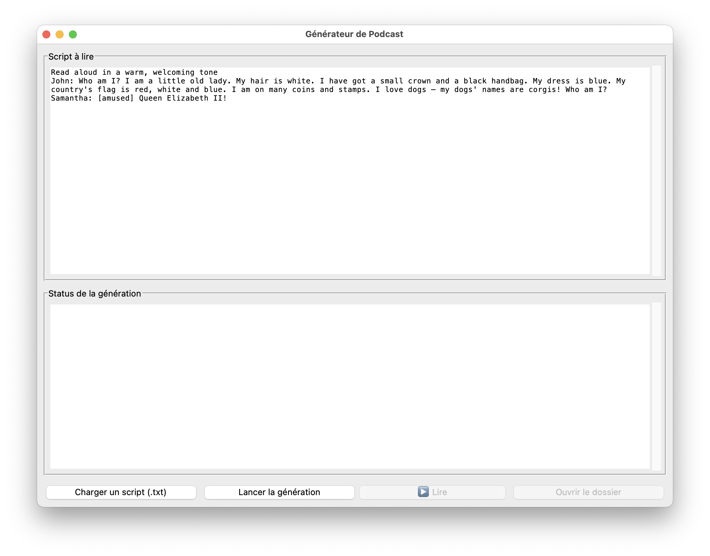

# Podcast Generator
[](https://www.buymeacoffee.com/laurentftech)

Si vous appréciez ce projet et souhaitez soutenir mon travail, vous pouvez [m’offrir un café](https://www.buymeacoffee.com/laurentftech) ☕. Merci pour votre soutien !

---

## 📖 Présentation

Une application Python légère avec une interface utilisateur moderne qui vous permet de générer des podcasts multi-intervenants à partir de n’importe quel script. Elle utilise les voix de haute qualité des API **ElevenLabs** et **Google Gemini**, et peut même créer des démos HTML synchronisées de vos podcasts.

### 🔑 Pour commencer
Obtenez votre clé API gratuite sur [ElevenLabs](https://try.elevenlabs.io/zobct2wsp98z) (ou Google Gemini).
Ajoutez-la de manière sécurisée dans l’application.
Commencez à créer vos podcasts en quelques minutes.

💡 **Remarque** : Je suis **affilié** à ElevenLabs. L’utilisation de ce lien peut me rapporter une commission, sans coût supplémentaire pour vous. ElevenLabs propose également un **niveau gratuit** avec des limites mensuelles de caractères pour les voix premium.



---

## ✨ Fonctionnalités

- **Interface Moderne** : Une interface claire, moderne et réactive construite avec `customtkinter` qui s'adapte au mode clair ou sombre de votre système.
- **Double Fournisseur TTS** : Choisissez entre les voix de haute qualité de **Google Gemini** ou **ElevenLabs**.
- **Analyse IA des Scripts** : Générez des documents DOCX avec une analyse IA de vos scripts de podcast, incluant des résumés, des questions de compréhension pour différents niveaux de langue (A1, A2, B1), et des informations pédagogiques clés. Parfait pour les enseignants de langues et les créateurs de contenu.
- **Démo HTML Synchronisée** : Générez automatiquement une page HTML partageable avec l'audio de votre podcast et une transcription synchronisée et surlignée.
- **Formats flexibles** : Export en **MP3** (par défaut) ou **WAV**.
- **Personnalisation** : Sauvegarde des voix et paramètres pour chaque locuteur.
- **Guides vocaux** : Explorez et écoutez toutes les voix disponibles de Gemini et ElevenLabs directement depuis les réglages. Ajoutez vos voix préférées à votre liste de locuteurs en un seul clic.
- **Lecture intégrée** : Écoutez et arrêtez vos créations directement depuis l'application (**FFmpeg requis**).
- **Stockage sécurisé de la clé API** : Votre clé API Google Gemini est demandée une seule fois et enregistrée de manière sécurisée dans le trousseau du système (`keyring`).
- **Support des accents et langues** : Créez des podcasts en plusieurs langues avec des voix et des accents distincts pour chaque langue (depuis les réglages des locuteurs avec l'API ElevenLabs ou depuis le prompt avec Gemini).
- **Support Docker** : Exécutez l'application en tant que service web à l'aide de Docker. Cela simplifie le déploiement, ne nécessite aucune installation supplémentaire et peut fonctionner sur un petit serveur ou localement.

---

## 🌍 Support multilingue

Grâce aux API Google Gemini et ElevenLabs, **Podcast Generator** permet :

- De créer des podcasts multilingues avec des voix et des accents distincts pour chaque langue.
- D'adapter le ton émotionnel à partir du script.
- De produire du contenu pour un public international.
- De faciliter l’apprentissage des langues avec des dialogues réalistes.
- D’améliorer l’accessibilité en adaptant la langue à votre public cible.

---

## 💡 Cas d'utilisation

- **Enseignement et Formation**  
  Transformez vos supports de cours ou tutoriels en podcasts audio multilingues pour engager vos apprenants.

- **Création de Contenu**  
  Automatisez la production de podcasts dans différentes langues pour toucher un public plus large.

- **Accessibilité**  
  Rendez votre contenu accessible à un public plus large grâce au support multilingue.

- **Pratique des Langues**  
  Créez des dialogues multilingues avec des voix distinctes pour chaque personnage.
  
---

## 💡 Exemples d’utilisation

### Script simple
```txt
John: Bonjour à tous, bienvenue dans ce nouvel épisode.
Samantha: Aujourd'hui, nous allons explorer les bases de l’intelligence artificielle.
John: Restez avec nous pour en savoir plus !
Samantha: N'oubliez pas de vous abonner.
```

⚠️ Important : Les noms des locuteurs dans votre script (ex: John:, Samantha:) doivent correspondre exactement aux noms définis dans la fenêtre "Réglages des voix". L'application n'effectue aucune vérification, et une non-concordance entraînera une erreur de génération ou une mauvaise attribution des voix.

### Script multilingue
```txt
John (fr): Bonjour à tous, bienvenue dans ce nouvel épisode.
Samantha (en): Hello everyone, welcome to this new episode.
John (es): Hola a todos, bienvenidos a este nuevo episodio.
```

---

## 📝 Analyse IA des Scripts (Interface Web)

L'interface web inclut une fonctionnalité d'analyse IA optionnelle qui génère des documents DOCX professionnels analysant vos scripts de podcast. Cette fonctionnalité est particulièrement utile pour les **enseignants de langues**, les **créateurs de contenu** et les **développeurs de matériel pédagogique**.

### Contenu de l'Analyse

Le document DOCX généré contient :
- **Résumé** : Un aperçu concis du contenu du podcast
- **Personnages Principaux** : Les intervenants et personnalités clés mentionnés
- **Lieux Importants** : Les endroits importants référencés dans le script
- **Thème Central** : Le message ou sujet principal
- **Questions de Compréhension** : Questions adaptées à différents niveaux de compétence linguistique :
  - A1 (Débutant)
  - A1+/A2 (Élémentaire)
  - A2+/B1 (Intermédiaire)

### Instructions de Configuration

Pour activer cette fonctionnalité dans l'interface web :

1. **Configurer la Clé API Gemini**
   Ajoutez votre clé API Gemini au fichier `.env` :
   ```bash
   GEMINI_API_KEY=votre_clé_ici
   ```

2. **Créer le Fichier de Prompt d'Analyse**
   Copiez l'exemple de configuration du prompt :
   ```bash
   cp config/analysis_prompt.txt.example config/analysis_prompt.txt
   ```

3. **Personnaliser le Prompt (Optionnel)**
   Éditez `config/analysis_prompt.txt` pour modifier la façon dont l'IA analyse vos scripts. Vous pouvez ajuster :
   - Les types de questions générées
   - Les niveaux de langue ciblés
   - La profondeur et les domaines d'analyse
   - Les préférences de formatage de sortie

4. **Accéder à la Fonctionnalité**
   Une fois configuré, un bouton violet "Generate DOCX Analysis" apparaîtra à côté du bouton "Generate Podcast" dans l'interface web.

### Emplacements des Fichiers

- **Docker** : `./config/analysis_prompt.txt`
- **macOS** : `~/Library/Application Support/PodcastGenerator/analysis_prompt.txt`
- **Windows** : `%APPDATA%/PodcastGenerator/analysis_prompt.txt`
- **Linux** : `~/.config/PodcastGenerator/analysis_prompt.txt`

Pour plus de détails, consultez le fichier `config/README.md`.

---

## 📦 Installation

### 1. Dépendance externe : FFmpeg (obligatoire)

Pour la conversion et la lecture audio, **FFmpeg** doit être installé sur votre système.

#### **macOS**
Installer via [Homebrew](https://brew.sh/) :
```bash
brew install ffmpeg
```

#### **Linux**
Installer via le gestionnaire de paquets :
```bash
sudo apt install ffmpeg        # Debian/Ubuntu
sudo dnf install ffmpeg        # Fedora
sudo pacman -S ffmpeg          # Arch
```

#### **Windows (guide détaillé)**

1. **Télécharger FFmpeg**  
   Rendez-vous sur la page officielle des builds :  
   👉 [https://www.gyan.dev/ffmpeg/builds/](https://www.gyan.dev/ffmpeg/builds/)  
   Téléchargez l’archive **"release full"** (ex. `ffmpeg-release-full.7z` ou `.zip`).

2. **Extraire l’archive**  
   - Clic droit → **Extraire tout…**  
   - Vous obtenez un dossier du type `ffmpeg-2025-xx-xx-full_build`.

3. **Déplacer le dossier**  
   - Déplacez le dossier `ffmpeg` dans un emplacement permanent, par exemple :  
     `C:\ffmpeg`

4. **Ajouter FFmpeg au PATH**  
   - Appuyez sur **Windows + R**, tapez :
     ```
     sysdm.cpl
     ```
     puis **Entrée**.
   - Onglet **Avancé** → **Variables d’environnement**.
   - Dans **Variables système**, sélectionnez **Path** → **Modifier**.
   - Cliquez sur **Nouveau** et ajoutez :
     ```
     C:\ffmpeg\bin
     ```
   - Validez avec **OK**.

5. **Vérifier l’installation**  
   - Ouvrez **Invite de commandes** et tapez :
     ```
     ffmpeg -version
     ```
     Vous devez voir la version installée.

---

### 2. Installation de l’application

1. Rendez-vous sur la page **Releases** du projet.  
2. Téléchargez l’archive adaptée à votre système :
    - **macOS/Linux** : `.tar.gz`
    - **Windows** : `.zip` ou `.tar.gz`
3. **Extraire** l’archive :
    - macOS/Linux : double-clic ou `tar -xzf fichier.tar.gz`
    - Windows : clic droit → **Extraire tout…**
4. **Placer** le dossier où vous le souhaitez.

---

### 💡 Note pour macOS

Au premier lancement, macOS affichera un avertissement de sécurité car l’application n’est pas signée.

1. Double-cliquez sur l’application (un message bloquera l’ouverture).  
2. Ouvrez **Réglages Système → Confidentialité et sécurité**.  
3. Cliquez sur **Ouvrir quand même**.  
4. Confirmez.

---

### 💡 Note pour Windows (Windows 10 / 11)

Lors du premier lancement, **Windows SmartScreen** peut bloquer l’application.

1. Message *"Windows a protégé votre ordinateur"*.
2. Cliquez sur **Informations complémentaires**.
3. Cliquez sur **Exécuter quand même**.

Une fois validé, Windows ne vous le demandera plus.

---

### Premier lancement : clé API

Lors du premier démarrage, l’application vous demandera votre clé **API ElevenLabs** (et éventuellement votre clé **API Google Gemini**).  
Elle sera stockée de manière sécurisée.

---

## 🚀 Fonctionnalité avancée : Génération de démo HTML (optionnel)

L'application peut générer une page HTML partageable avec l'audio de votre podcast et une transcription synchronisée, mot par mot. C'est parfait pour partager des démos ou pour l'accessibilité.
Voir un exemple de page HTML générée [ici](https://laurentftech.github.io/Podcast_generator/assets/who_am_i.html).

### Installation des dépendances optionnelles pour la génération de démo

Cette fonctionnalité repose sur whisperx pour l'alignement audio, qui nécessite PyTorch. Ce sont des dépendances lourdes, elles sont donc optionnelles. Pour activer cette fonctionnalité, vous devez les installer manuellement.

1. Installez PyTorch

Il est fortement recommandé d'installer la version CPU de PyTorch, car elle est beaucoup plus légère et suffisante pour cette application. Visitez le site officiel de PyTorch et sélectionnez les options appropriées pour votre système.
Par exemple, en utilisant conda

```Shell
conda install pytorch torchaudio cpuonly -c pytorch
```

2. Installez WhisperX

Une fois PyTorch installé, vous pouvez installer whisperx et ses autres dépendances en utilisant l'extra [demo] :

```Shell
pip install .[demo]
```

---

## 👨‍💻 Pour les développeurs

Voir **DEVELOPERS-fr.md** pour exécuter le code ou contribuer au projet.

---

## 📜 Licence

Ce projet est sous licence MIT — voir le fichier [LICENSE](../LICENSE) pour plus de détails.

---

## 🤝 Contributions

Les contributions sont les bienvenues ! Consultez le fichier [DEVELOPERS-fr.md](DEVELOPERS-fr.md) pour les règles de contribution.

---

Merci d’utiliser **Podcast Generator** ! ☕
